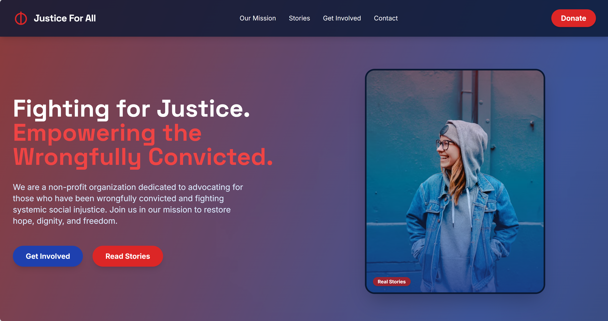

# Justice For All – Social Injustice Non-Profit Landing Page

A modern, fully responsive landing page template for non-profit organizations focused on social injustice and supporting the wrongfully convicted. Built with Tailwind CSS, custom fonts, and engaging imagery, this template is designed for maximum impact, accessibility, and ease of customization.

## 🌐 Live Demo

[](https://your-demo-url.com)

## 📸 Screenshot



## 🏷️ Badges


## ✨ Features

- **Bold, Accessible Design:** High-impact color palette (shades of red, deep blue, and gray) with strong typography using Satoshi, Inter, and Space Grotesk fonts.
- **Responsive Layout:** Grid and flexbox ensure seamless experience across devices.
- **Mobile Navigation:** Hamburger menu for easy navigation on small screens.
- **Animated Impact Stats:** Counters for cases won, people helped, and years of service.
- **Newsletter Signup:** Collect supporter emails with a styled form.
- **Social Media Links:** Prominent icons for Twitter, Facebook, and Instagram.
- **Back-to-Top Button:** Smooth scroll for improved usability.
- **Accessibility:** Semantic HTML, ARIA labels, and keyboard navigation support.
- **Performance Optimizations:** Font preconnect, lazy-loaded images, and optimized SVGs.
- **SEO Ready:** Meta description, favicon, and Open Graph friendly structure.
- **404 Page:** Custom error page for static hosting.

## 📋 Table of Contents

- [Live Demo](#-live-demo)
- [Screenshot](#-screenshot)
- [Features](#-features)
- [Getting Started](#getting-started)
- [File Structure](#file-structure)
- [Customization](#customization)
- [Deployment](#deployment)
- [Contributing](#contributing)
- [Credits](#credits)
- [License](#license)

## 🚀 Getting Started

1. **Clone the repository:**
   ```sh
   git clone https://github.com/your-org/justice-for-all-landing.git
   cd justice-for-all-landing
   ```
2. **Open `index.html` in your browser.**
   - No build step required. All dependencies are loaded via CDN.

## 📁 File Structure

```
├── index.html         # Main landing page
├── styles.css         # Custom CSS (fonts, background texture)
├── site.js            # JavaScript for interactivity
├── 404.html           # Custom 404 error page
├── favicon.ico        # Favicon (add your own)
├── screenshot.png     # Screenshot for README
├── LICENSE            # MIT License
├── CONTRIBUTING.md    # Contribution guidelines
└── .github/
    ├── ISSUE_TEMPLATE/
    │   ├── bug_report.yml
    │   └── feature_request.yml
    └── PULL_REQUEST_TEMPLATE.md
```

## 🛠️ Customization

- **Images:** Replace Unsplash image URLs in `index.html` with your own or organization’s photos.
- **Colors:** Adjust Tailwind classes or custom CSS for your brand palette.
- **Content:** Update text, stats, and links to reflect your mission and impact.
- **Newsletter:** Integrate with your email provider (e.g., Mailchimp) by updating the form action.
- **Social Links:** Replace `#` in social icons with your actual profile URLs.

## 🌍 Deployment

This template is ready for static hosting (GitHub Pages, Netlify, Vercel, Azure Static Web Apps, etc.).

## 🤝 Contributing

We welcome contributions! Please see [CONTRIBUTING.md](CONTRIBUTING.md) for guidelines.

## 🙏 Credits & Thanks

- **Fonts:** [Satoshi](https://github.com/adamgyulavari/satoshi-font), [Inter](https://fonts.google.com/specimen/Inter), [Space Grotesk](https://fonts.google.com/specimen/Space+Grotesk)
- **Images:** [Unsplash](https://unsplash.com/)
- **CSS Framework:** [Tailwind CSS](https://tailwindcss.com/)
- **Inspiration:** Thanks to all contributors and the open source community for making this possible.

## 📣 Social Preview

Add a `social-preview.png` (1200x630px) to the repo for a beautiful GitHub social card.

## 📝 License

MIT License. See [LICENSE](LICENSE) for details.
